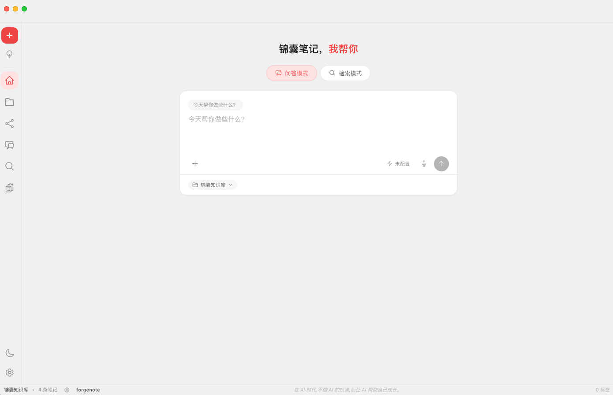
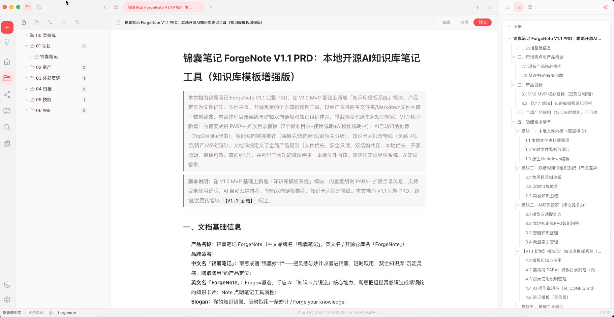
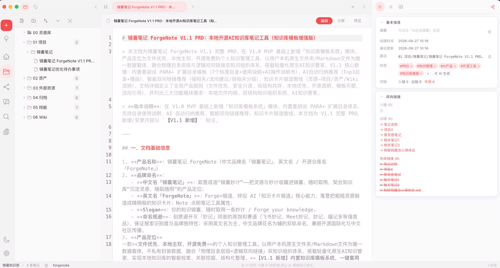
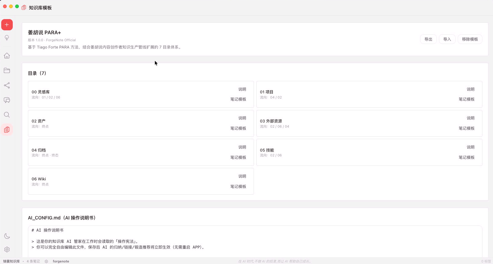
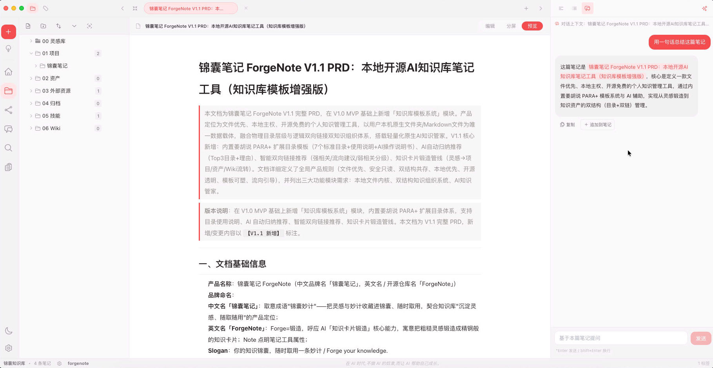
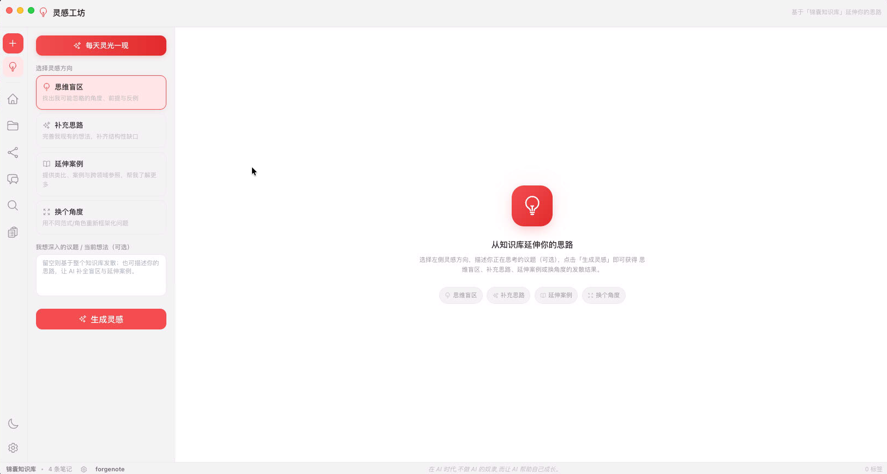
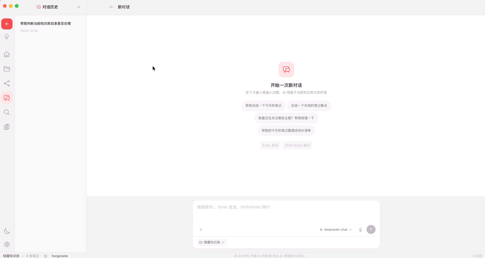
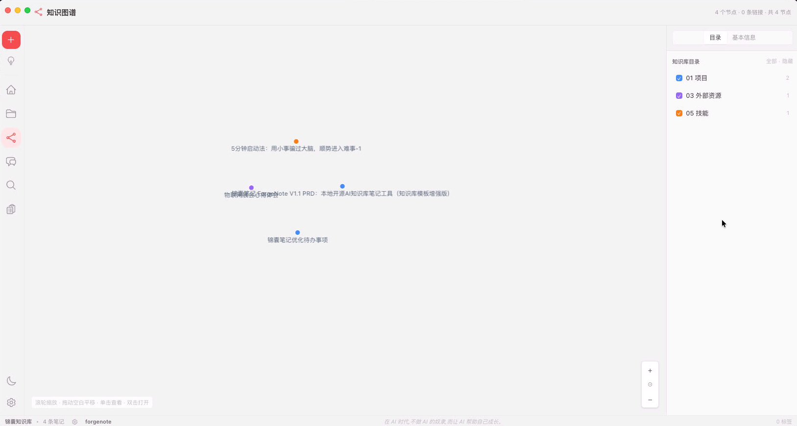
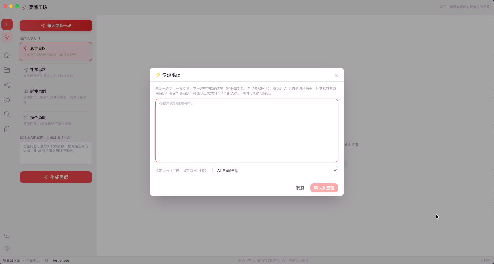
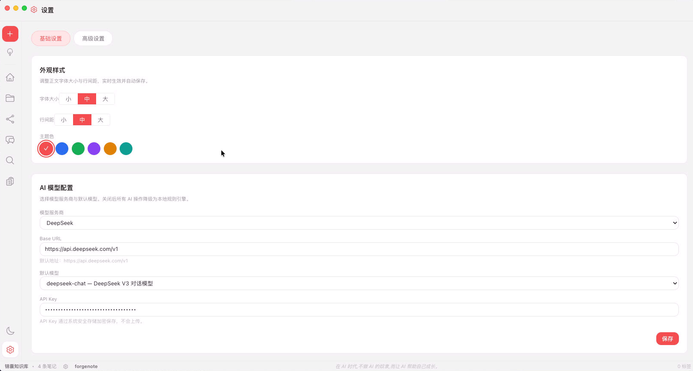

# 锦囊笔记 ForgeNote

> **Forge your knowledge.** 你的知识锦囊，随时取用一条妙计。

> 在 AI 时代，不做 AI 的奴隶，而让 AI 帮助自己成长。

一款**文件优先、本地主权、开源免费**的个人知识管理桌面应用。基于 Electron + TypeScript + React 构建，实现「物理目录 + 双向链接」双知识组织体系，并搭载本地 AI 知识管家，帮助你把零散信息快速锻造为结构化、可复用的知识资产。


---

## 一、产品特征

- 📁 **文件优先（File-First）**：所有笔记都是本地原生 Markdown 文件，APP 只是"视图 + AI 增强"，绝不私有封装、不锁定你的数据。换软件、换电脑，文件直接可用。
- 🌳 **双结构组织**：物理目录树（规整）+ 双向链接网络（关联）共存，兼顾秩序与灵感。
- 🤖 **本地 AI 管家**：支持 Ollama 本地大模型与 OpenAI 兼容远端模型；未配置模型时自动降级为本地规则引擎，离线也能用。
- 🧠 **AI 一键整理**：自动归纳摘要、推荐归档目录、推荐双向链接、锻造标准化知识卡片。
- 🔗 **外部资源收纳**：粘贴带链接（如分享对话、产品网页）的内容，自动抓取整篇正文、归入合适目录并记录原始链接。
- 🔍 **多维检索**：全文搜索 + 标签视图 + 双向链接 + 模板目录过滤，快速定位。
- 🌐 **知识图谱**：可视化笔记之间的关联，一眼看清知识网络。
- 🛡 **隐私安全**：进程隔离 + 沙箱 + API Key 加密存储 + AI 操作审计 + 一键撤销。

## 二、产品功能与优势

### 核心功能
| 功能 | 说明 |
| --- | --- |
| 多知识库 | 任意本地目录均可作为知识库，数据完全自持 |
| 知识库模板 | 内置「姜胡说 PARA+」模板（00 灵感库 / 01 项目 / 02 领域 / 03 外部资源 / 10 归档 / 11 素材 / 12 复盘），一键应用 |
| 新建笔记 | 可选目录、套用目录模板（支持 `{{name}}` `{{date}}` 等变量），实时预览填充效果 |
| AI 归档推荐 | 依据 `AI_CONFIG.md` 规则推荐最合适目录，确认后移动 |
| AI 链接推荐 | 推荐可建立的双向链接，勾选即插入 |
| 知识卡片锻造 | 按"四铁律"将灵感提炼为标准卡片，写入目标目录 |
| 快速笔记 | 粘贴一段话/文章/链接，AI 自动归纳、补充标签与双向链接 |
| 分屏浏览 | 左侧原文与右侧预览双向滚动同步，编辑体验流畅 |
| 启动向导 | 首次引导选择知识库目录、可选套用模板，路径失效自动重走向导 |
| 外观样式 | 字体大小（小/中/大）、行间距（小/中/大）、主题色自由切换，实时生效 |
| 操作审计 | 所有 AI 操作留痕，可一键撤销 |

### 相比传统笔记软件的优势
1. **数据永不属于厂商**：纯本地 Markdown，无云绑定、无格式锁定。
2. **AI 是你的管家而非黑箱**：所有 AI 改动都"建议 + 你确认"后才落盘，且全程可审计、可撤销。
3. **本地优先、隐私可控**：本地模型优先，离线可用；API Key 加密存储。
4. **结构化而非信息坟场**：模板 + 双链 + 卡片锻造，让笔记真正沉淀为知识。
5. **轻量开源、可塑性强**：技术栈主流、代码可读，模板与提示词均可在 `README.md` / `AI_CONFIG.md` 中自由修改。

## 三、操作界面

### 1. 首页（Home）

启动后的默认落点，提供两大入口：

- **问答模式**：在搜索框输入问题，由 AI 结合当前知识库内容检索并作答。
- **检索模式**：输入关键词，回车进入「检索结果页」列出匹配笔记。
- **顶部控制条**：可切换当前 AI 模型、选择知识库；并展示本库笔记数 / 标签数 / 双向链接数等概览。



### 2. 知识库管理（左侧栏）

- **文件优先**：选择本地任意文件夹即作为一个知识库，所有笔记为原生 Markdown 文件，APP 仅是视图与 AI 增强层。
- **多知识库**：可同时管理多个知识库，在首页或检索页一键切换。
- **双结构组织**：左侧物理目录树（规整存储）+ 双向链接（关联网络）共存，互相打通。
- **新建目录 / 笔记**：支持在任意层级创建目录与笔记。



### 3. 笔记编辑（NotePane）

基于 CodeMirror 6 的本地 Markdown 编辑器，顶部工具条提供：

- **📂 归档**：AI 按规则推荐最合适的目标目录，勾选确认后自动移动（保留原相对结构）。
- **🔗 链接**：AI 推荐 3–5 条可建立双向链接的笔记，勾选后插入 `[[笔记名]]`。
- **生成摘要 / 标签**：AI 自动生成摘要写入 frontmatter，并建议标签（最多 8 个，合并去重）。
- **多标签**：可同时打开多篇笔记，顶部标签栏切换。
- **双链与预览**：支持 `[[笔记名]]` 双向链接、实时预览、标签、断链高亮。



### 4. 知识库模板（Template）

V1.1 内置「姜胡说 PARA+ 7 目录」模板，进入「模板」页可：

- **一键应用**：在根目录创建 7 个标准目录及说明文件（已存在目录自动跳过）。
- **目录说明**：为每个目录编辑 `README.md` 说明其用途与流向（项目 / 领域 / 资源 / 归档等）。
- **笔记模板**：为每个目录定制 `.template.md` 新建笔记模板，支持变量 `{{name}} {{kbName}} {{date}} {{time}} {{timestamp}}`，可实时预览、一键重置为默认。
- **AI_CONFIG.md**：可视化编辑 AI 操作说明书（控制归档/链接/锻造等行为规则），可直接保存。
- **导入 / 导出**：模板可导出为 `.kbtemplate` 文件，或导入到其它知识库复用。



### 5. AI 知识管家（问答 + 灵感工坊 + 锻造）

- **模型接入**：支持 Ollama（本地）、DeepSeek、OpenAI、Moonshot 等。设置中配置 Base URL、默认模型、API Key（经系统安全存储加密，不上传）。关闭后所有 AI 操作降级为本地规则引擎，功能不中断。
- **灵感工坊（Inspiration）**：在「00 灵感库」打开灵感笔记，可选多种「灵感方向」让 AI 发散，或「每天灵感一现」自动生成一条灵感；提示词均可在高级设置中自定义。
- **知识卡片锻造（⚒ 锻造）**：在灵感笔记上点击锻造，AI 按「四铁律」提炼为标准知识卡片（核心观点 / 详细内容 / 可行动项 / 验证标准 / 相关链接），确认后写入「10 知识库」并保持双向链接。
- **摘要与标签**：编辑器中一键生成摘要与标签，沉淀到 frontmatter。







### 6. 知识图谱（Graph）

力导向图可视化全部笔记关联，按一级目录着色；支持滚轮缩放、拖拽平移、单击查看节点基本信息（出/入链、创建/更新时间）、双击打开笔记；右侧栏可按目录显隐过滤。



### 7. 快速笔记（QuickNote）


### 8. 设置页面


## 四、技术栈

| 层 | 选型 |
| --- | --- |
| 桌面壳 | Electron 31 |
| 渲染层 | React 18 + TypeScript + Vite（electron-vite） |
| 编辑器 | CodeMirror 6 |
| 文件监听 | chokidar |
| 本地数据库 | better-sqlite3（配置 / 审计） |
| 状态管理 | Zustand |
| 样式 | TailwindCSS |
| LLM 接入 | Ollama / OpenAI 兼容（可扩展） |
| 图谱 | 自研 Canvas 2D 力导向图 |
| 打包 | electron-vite + electron-builder |

### 目录结构
```
forgenote/
├── src/
│   ├── main/           # Electron 主进程（kb / fs / template / ai / search / audit 服务）
│   ├── preload/        # 预加载脚本（contextBridge 类型化 API）
│   ├── renderer/       # React 渲染层（components / pages / stores / utils / styles）
│   └── shared/         # 主/渲染进程共享类型
├── resources/templates/para-plus/  # 内置 PARA+ 模板
├── electron.vite.config.ts
├── tailwind.config.js
└── package.json
```

## 五、快速开始

### 环境要求
- Node.js >= 18
- npm / pnpm / yarn

### 安装与运行
```bash
cd forgenote
npm install
npm run dev        # 启动开发模式（自动打开窗口 + 热更新）
```

### 打包
```bash
npm run package:mac    # macOS
npm run package:win    # Windows
# 产物输出到 release/
```

### 配置 AI（可选）
进入「设置 → AI 模型配置」：
- **关闭**：所有 AI 操作降级为本地规则引擎。
- **Ollama**：填入 `http://127.0.0.1:11434` 与模型名（需先 `ollama pull qwen2.5:7b`）。
- **OpenAI 兼容**：填入 base URL、模型名、API Key（如 DeepSeek、Moonshot 等）。

## 六、协议（MIT 开源）

本项目以 **MIT License** 开源，详见 [forgenote/LICENSE](./forgenote/LICENSE)。

在遵循 MIT 协议的前提下，你可以自由地使用、复制、修改、再分发本项目的源代码与构建产物，包括用于个人和商业目的。

### ⚠️ 附加社区准则（非法律限制，而是作者与社区的共识约定）

**作者鼓励开源协作与学习，但明确不支持、不赞同将本项目「闭源后用于商业转卖」。** 具体而言：

1. 你可以 fork、修改、学习、用于个人或公司内部，欢迎提 PR 共建。
2. 你可以基于本项目做二次开发并开源再分发，**前提是保留原作者署名与 MIT 协议声明**，且不得移除本项目的版权与许可信息。
3. **禁止将本项目（含其修改版本）闭源封装后作为独立产品进行商业售卖、转卖或订阅获利**。若你希望将本项目用于闭源商业产品，请先与作者联系授权。
4. 本附加声明不构成对 MIT 协议法律条款的修改；如与 MIT 文本冲突，以 [LICENSE](./forgenote/LICENSE) 中的标准 MIT 文本为准，但作者保留就闭源转卖行为采取相应措施的权利。

> 一句话：**代码自由，请勿把它改头换面后当成你的闭源商品卖。**

---

## 七、路线图

- ✅ V1.0 MVP：本地文件内核、双结构、基础 AI、图谱
- ✅ V1.1 知识库模板系统：PARA+ 模板、归纳推荐、链接推荐、卡片锻造、AI_CONFIG 动态注入
- 🔜 V1.2：万级文件性能优化、批量 AI 整理、PDF/TXT 解析、更多官方模板

---

ForgeNote Team · 让每一份灵感都被妥善锻造。
